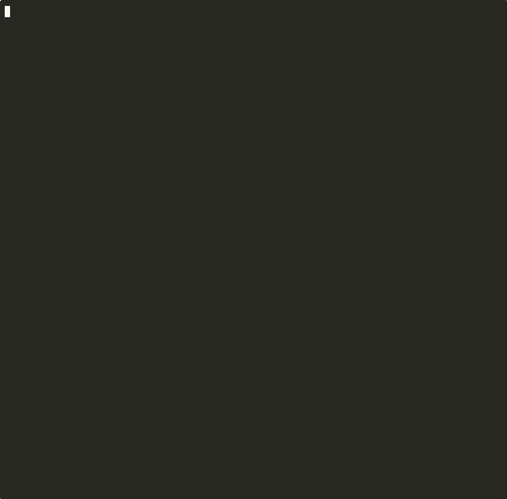

# deadkit

**Observability for AI coding infra — find dead rules, unused skills, and token waste.**

The AI coding ecosystem has tools to *create* rules (ECC, gstack, superpowers) and tools to *monitor* LLM API calls (Langfuse, Helicone). But nobody asks: **"Are my rules actually doing anything?"**

deadkit sits in that gap. It's the first tool that measures whether your AI coding config is alive or dead.

> We tested [Everything Claude Code](https://github.com/affaan-m/everything-claude-code) (136 rules, 5 skills)
> against 34 real sessions across 391 log files (167MB):
>
> **61 rules were dead. 5 skills never called. 90K tokens wasted — 45% of context window, gone.**

**[한국어 README](README.ko.md)**

## Demo



## Quick Start

```bash
# One-shot analysis
npx deadkit

# Start continuous tracking
npx deadkit init

# View trends after a few sessions
npx deadkit trend
```

No API keys. No setup. No runtime dependencies.

## Verification Results

We tested deadkit against real data. Here's what we found:

| Test | Result | Detail |
|------|--------|--------|
| Dead rule accuracy | Correct | 136 ECC rules: 61 dead (10 languages with zero file edits) |
| Duplicate detection | Correct | 0 false positives at Jaccard 0.6 threshold |
| Skill tracking | Correct | Verified against real JSONL logs — tool_use structure matches |
| Hook collection | Working | Edit/Write/Skill calls captured in real-time during sessions |
| Performance | Fast | 167MB logs (32K lines, 391 files) processed in 1-3 seconds |

## What it finds

### Rules (passive — always loaded every prompt)

| Check | What it finds |
|-------|--------------|
| **Dead rules** | Rules for languages you never use (based on session logs) |
| **Duplicates** | Rules that overlap with each other |
| **Overlapping directives** | Same instruction copied across multiple files |
| **Claude defaults** | Rules that repeat Claude's built-in behavior |
| **Vague directives** | Instructions too abstract to be actionable |
| **Token cost** | How many tokens each rule file consumes |
| **Stale rules** | Rules not modified in 90+ days |

### Skills (active — user calls them)

| Check | What it finds |
|-------|--------------|
| **Never used** | Skills installed but never called |
| **Usage stats** | How often each skill is called, when last used |
| **Overlapping** | Skills with similar descriptions (Claude may confuse them) |
| **Description cost** | Token cost of skill descriptions (loaded every session) |

### Continuous Tracking (Phase 2 — new in v0.2.0)

| Command | What it does |
|---------|-------------|
| `deadkit init` | Install Claude Code hook for automatic data collection |
| `deadkit trend` | Show daily activity, top languages, skill usage over time |

## How it works

**Dead rules**: deadkit reads Claude Code session logs (`~/.claude/projects/*/*.jsonl`) across all projects. It extracts which file types you edit from `Edit`/`Write` tool calls, then cross-references with your rules. Python rules + zero `.py` edits = dead.

**Unused skills**: deadkit searches session logs for `Skill` tool calls. Skills installed but never invoked = unused. Skills with overlapping descriptions may cause Claude to pick the wrong one.

**Continuous tracking**: `deadkit init` installs a PostToolUse hook that logs every Edit/Write/Skill call to `~/.deadkit/history.jsonl`. Over time, `deadkit trend` shows how your usage patterns evolve.

**Why it matters**: Every rule is loaded into every prompt. Every skill description is loaded too. Dead rules and unused skills waste your context window silently — and nobody was measuring this until now.

## Two modes

| | Local (`npx deadkit`) | CI (GitHub Action / GitLab) |
|---|---|---|
| Dead rules (session logs) | O | X (no logs in CI) |
| Unused skills (session logs) | O | X (no logs in CI) |
| Continuous tracking | O | X |
| Duplicates / Overlaps | O | O |
| Claude defaults | O | O |
| Token cost | O | O |

**Local** finds dead rules and unused skills from your history. **CI** catches duplicates and token bloat on every PR.

## GitHub Action

```yaml
# .github/workflows/deadkit.yml
name: Rule Health Check
on: [pull_request]

permissions:
  pull-requests: write
  contents: read

jobs:
  deadkit:
    runs-on: ubuntu-latest
    steps:
      - uses: actions/checkout@v4
      - uses: JSK9999/deadkit@main
        with:
          paths: '.claude/rules'
```

## GitLab CI

```yaml
# .gitlab-ci.yml
deadkit:
  stage: test
  image: node:20
  script:
    - npx deadkit .claude/rules --json > deadkit-report.json
    - cat deadkit-report.json
  artifacts:
    paths:
      - deadkit-report.json
  rules:
    - if: $CI_MERGE_REQUEST_IID
```

## CLI

```bash
npx deadkit                    # Analyze rules + skills
npx deadkit ./rules/ ./agents/ # Custom paths
npx deadkit --json             # JSON output for CI/CD
npx deadkit init               # Install tracking hook
npx deadkit trend              # View usage trends
npx deadkit trend --json       # Trend data as JSON
```

## What it scans

- `~/.claude/rules/*.md` (global rules)
- `~/.claude/skills/*/SKILL.md` (installed skills)
- `.claude/rules/*.md` (project rules)
- `CLAUDE.md` (project root)
- `.cursorrules` (Cursor)

## The gap we're filling

```
  Rule creators              ???               LLM observability
  (ECC, gstack,         [deadkit]            (Langfuse, Helicone,
   superpowers)        "Is it working?"        Datadog LLM)
       |                    |                       |
  Create rules/skills  Measure effectiveness  Monitor API calls
```

No tool existed to answer: *"Are my rules effective? Are my skills being used? How much context am I wasting?"*

We searched. There are 0 tools in this space. deadkit is the first.

## Roadmap: From Linter to Observability

### Phase 1: Linter (done)
- [x] Dead rule detection (session log analysis)
- [x] Unused skill detection
- [x] Duplicate / overlap / vagueness analysis
- [x] Token cost breakdown
- [x] `--json` output
- [x] GitHub Action / GitLab CI

### Phase 2: Continuous Collection (done)
- [x] `deadkit init` — install Claude Code hook
- [x] `~/.deadkit/history.jsonl` — persistent metrics store
- [x] `deadkit trend` — daily activity and skill usage trends
- [ ] Per-rule hit tracking (which rules actually influenced responses)

### Phase 3: Trends & Alerts
- [ ] `deadkit trend --chart` — terminal chart visualization
- [ ] Token budget threshold — block PR if rules exceed N tokens
- [ ] Skill drift detection — alert when skill usage pattern changes
- [ ] Weekly report generation

### Phase 4: Dashboard & Team
- [ ] `deadkit dashboard` — web UI for rule/skill health
- [ ] Team-wide rule analytics (aggregated across members)
- [ ] Rule effectiveness scoring (did this rule improve code quality?)
- [ ] Cross-tool comparison (Claude Code vs Cursor vs Codex)

## Known Limitations

Being transparent about what works and what doesn't:

- **Dead rule detection** only works for language-specific rules (e.g., `python/security.md`). Generic rules like `common/security.md` can't be mapped to a language — they're skipped, not flagged.
- **Negation blindness**: "Use X" and "Never use X" may be detected as overlapping because stop words (no, never, not) are filtered out. Semantically opposite rules could be flagged as duplicates.
- **Claude default list** is manually maintained (12 patterns). It's incomplete — contributions welcome.
- **Skill tracking** only covers `~/.claude/skills/`. Built-in skills and project-level skills are not tracked yet.
- **No causal proof**: deadkit can tell you a rule is *loaded* but never *relevant* (dead). It cannot yet prove a rule *caused* better output (effectiveness). That's Phase 4.

## We need your help

This is a new category — **AI coding config observability**. We're building it in the open and we need feedback from real users.

**What would make deadkit useful for you?**

- [Open an issue](https://github.com/JSK9999/deadkit/issues) with your use case
- Share your `deadkit --json` output (anonymized) — we want to understand real-world rule/skill setups
- Suggest Claude default patterns for `src/analyzers/defaults.ts` ([good first issue](https://github.com/JSK9999/deadkit/issues))
- Try `deadkit init` and report what `deadkit trend` shows after a week

We believe this gap — between rule creation and LLM monitoring — is the most underserved layer in the AI coding ecosystem. Help us prove it.

## Contributing

See [CONTRIBUTING.md](CONTRIBUTING.md) for setup and guidelines.

## License

Apache 2.0
